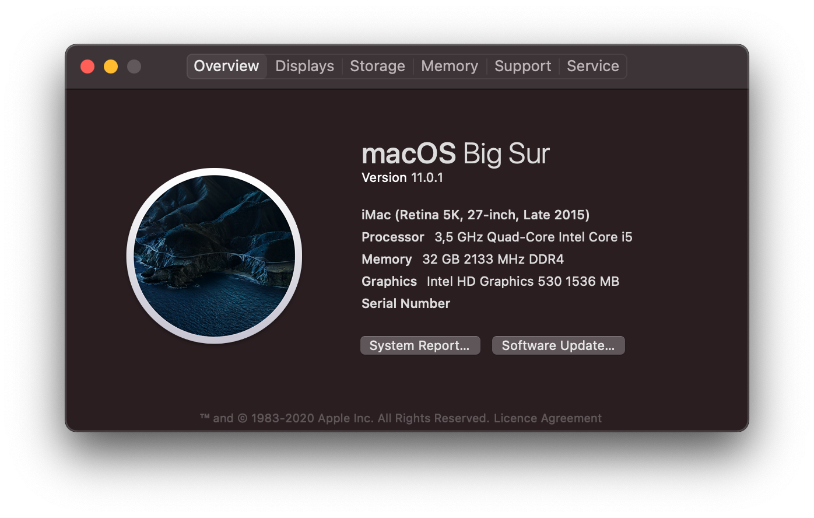

# Z170i-Pro-Gaming-OpenCore

Fork from [BrushXue/Z170i-Pro-Gaming-OpenCore](https://github.com/BrushXue/Z170i-Pro-Gaming-OpenCore)

## Differences from the source
1. Removed dGPU support
2. Enabled Displayport on iGPU HD 530 (i5-6600K)
- Most likely it won't work with HD 630

---

I am not a professional developer. I am just an enthusiast following the official documentation and sharing this working EFI. Similar configuration (Z170+skylake) might still work with minor modifications but I can't guarantee. If you have any debugging questions, please ask the author of the kext!

This is an OpenCore version of ASUS Z170i Pro Gaming Hackintosh EFI. It works on macOS Big Sur (11.0.1). FCPX GPU rendering works smoothly. HDR can be enabled. Sleep, Airdrop and Handoff are supported.

Big Sur requires OpenCore 0.6.3. Please update EFI first then upgrade macOS.

## Notes
0. Remember to generate and add `Serial`, `Board Serial` and `SmUUID` - [PlatformInfo](https://dortania.github.io/OpenCore-Install-Guide/config.plist/skylake.html#platforminfo)
1. Remember to clear NVRAM when switching between Clover and OpenCore.
2. I strongly recommend Xcode or other plist editors instead of OpenCore Configurator, as the plist structure changes in every update.
3. OpenCanopy and HiDPI are enabled. If you don't own a 4K monitor, disable it in `/EFI/OC/config.plist` -> `NVRAM/Add/4D1EDE05-38C7-4A6A-9CC6-4BCCA8B38C14/UIScale`.
4. I chose 15 USB ports in my USB map. 2x USB 3.0(front) + 4x USB 3.0(back) + 2x USB 2.0(back) + Bluetooth(internal via M.2) = 15 ports. Generally there's no front USB 2.0 port on ITX cases so I didn't include onboard USB 2.0 ports(HS11/HS12). I believe this is a reasonable trade-off for most people. However if you bought some strange Wi-Fi card which requires USB 2.0 header, you need follow [this guide](https://dortania.github.io/USB-Map-Guide/) to create your own USB map.
5. For onboard 3.5mm audio output you need to plug into the green(line out) jack. If you restart from Windows, there will be no sound. This is a issue in the Windows Realtek driver as they modified the DSDT. Always shutdown from windows then boot to macOS.

## Hardware
| Item | Brand | Model | Driver | Comment |
|-----|-----|-----|-----|-----|
| Motherboard | ASUS | Z170i Pro Gaming | | |
| CPU | Intel | i5-6600K | | |
| RAM | HyperX | Fury 2x16GB DDR4 3000 | | |
| iGPU | Intel | HD Graphics 530 | built-in | Displayport works |
| SSD | Samsung | 850 EVO SATA M.2 500GB | [NVMeFix](https://github.com/acidanthera/NVMeFix) | |
| Wireless | Broadcom | BCM94360NG M.2 | built-in | QCA61x4A was replaced* |
| Ethernet | Intel | I219-V | [IntelMausi](https://github.com/acidanthera/IntelMausi) | |
| Audio | Realtek | ALC1150 | [AppleALC](https://github.com/acidanthera/AppleALC) | |
| Case | Realan | 2016 Aluminum Mini ITX Case | | [aliexpress.com](https://www.aliexpress.com/item/32633891807.html) |
| AC Power Adapter | No name | ADP-43AB 150W | | [aliexpress.com](https://www.aliexpress.com/item/32256984424.html) |
| Pico PSU | No name | 24pin 150W | | |
| Monitor | Dell | U2720Q | | |

*QCA61x4A is not supported. Follow [this guide](https://www.tonymacx86.com/threads/bcm94352z-installed-on-asus-z170i-pro-gaming-wifi-and-bt.191274) the replace the onboard wireless card. Theoretically BCM94352Z or BCM94360CS2 with adapter can work as well.

## BIOS Setup
| Name | Option |
| --- | --- |
| SW Guard Extensions (SGX) | Disabled |
| CFG Lock | Disabled |
| VT-d | Disabled |
| Above 4G Decoding | Enabled |
| Primary Display | PCIE |
| iGPU-Multi-Monitor | Disabled |
| DVMT Pre-Allocated | 128M |
| IOAPIC 24-119 Entries | Disabled |
| Network Stack | Disabled |
| Legacy USB Support | Enabled |
| Fast Boot | Disabled |
| OS Type | Other OS |
| Launch CSM | Disabled |
